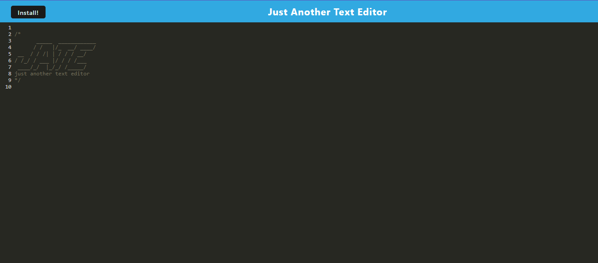

# Progressive Web App - Text Editor - John Zigterman

## Description

- This is a progressive web application that allows the user to enter text which is persistent.
- It can be accessed using a web browser when it is deployed on a hosting service.
- This app is a fullstack application that has both a server and a client side, and can be deployed locally as well.
- The app can be easily installed in any browser used to access it.

## Installation

This app can either be accessed where it is deployed online, or can be locally installed and tested by typing "npm install" and "npm run start" in a console opened in the root directory.

## Usage

The user can access this program to store, edit, and delete thoughts or notes in a manner that is intuitive and easy to use.

## Credits

I, John Paul Zigterman, completed this project by myself with the aid of the resources provided to me by the MSU coding bootcamp.

## Link

https://github.com/JohnPaulZigterman/PWA-text-editor 

## Screenshot

## License

MIT License

Copyright (c) 2023 John Paul Zigterman

Permission is hereby granted, free of charge, to any person obtaining a copy
of this software and associated documentation files (the "Software"), to deal
in the Software without restriction, including without limitation the rights
to use, copy, modify, merge, publish, distribute, sublicense, and/or sell
copies of the Software, and to permit persons to whom the Software is
furnished to do so, subject to the following conditions:

The above copyright notice and this permission notice shall be included in all
copies or substantial portions of the Software.

THE SOFTWARE IS PROVIDED "AS IS", WITHOUT WARRANTY OF ANY KIND, EXPRESS OR
IMPLIED, INCLUDING BUT NOT LIMITED TO THE WARRANTIES OF MERCHANTABILITY,
FITNESS FOR A PARTICULAR PURPOSE AND NONINFRINGEMENT. IN NO EVENT SHALL THE
AUTHORS OR COPYRIGHT HOLDERS BE LIABLE FOR ANY CLAIM, DAMAGES OR OTHER
LIABILITY, WHETHER IN AN ACTION OF CONTRACT, TORT OR OTHERWISE, ARISING FROM,
OUT OF OR IN CONNECTION WITH THE SOFTWARE OR THE USE OR OTHER DEALINGS IN THE
SOFTWARE.